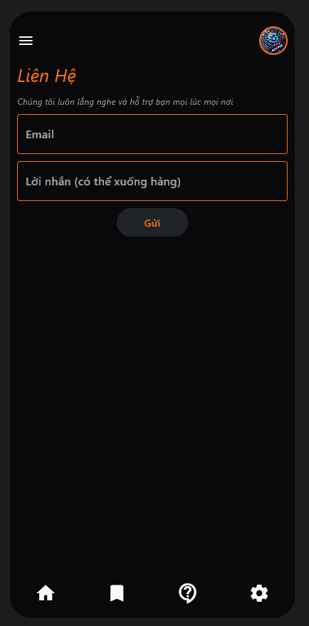

# Building Programing Courses

### Setup environment

Pre-requisites:
- Python version: 3.9+

```sh
# Create a virtual environment before running the next command
# Ctrl + Shift + P -> Python: Create Virtual Environment
.venv/Scripts/activate
```

#### Install dependencies

```bash
pip install -r requirements.txt
```

#### Create .env file

Create a file named `.env` in the root directory of the project and add the following content:

```
API_BE=db-name     # Default: "learning-app"
DOMAIN_BE=http://localhost:8000
SENTIMENT_API_DOMAIN=''
TURN_ON_SCREEN=True
```

## Run the project

```sh
flet -r main.py
```

## Struture of Project

```
app/
---api/
---constant/
---data/
---hook/
---schema/
---screens/
---services/
---style/
---test/
---util/
---__init__.py
assets/
doc/
main.py
test.py
README.md
```

1. **app/**: This is the main directory for the application code.
    - **api/**: Contains the API-related code, such as endpoints and views.
    - **constant/**: Stores constant values used across the application.
    - **data/**: Contains data-related files, possibly including data models or static data.
    - **hook/**: Includes custom hooks if using a framework that supports hooks.
    - **schema/**: Stores schema definitions, likely for database models or API request/response schemas.
    - **screens/**: Contains screen components, typically used in front-end frameworks like React Native or Flutter.
    - **services/**: Holds service-related code, such as API calls, business logic, or external service integrations.
    - **style/**: Includes styling-related files.
    - **test/**: Contains test cases for the application.
    - **util/**: Stores utility functions or helper modules.
    - **__init__.py**: A Python file to mark this directory as a package.

2. **assets/**: Stores static assets such as images, fonts, or other media files.

3. **doc/**: Includes documentation files for the project.

4. **main.py**: The main entry point of the application.

5. **test.py**: A script for running tests.

6. **README.md**: A markdown file containing the project description, setup instructions, and other relevant information.

7. **README.pdf**: A PDF version of the README file, potentially containing the same information as README.md.

## I. Overall this applications

- UI: using Flet Framework to build Mobile App (build Flutter App) - language Python
- Back End: using Django Framework to build Server Side API and apply model AI sentiment - language Python
- Database: using PostgreSQL to store data, register FREE on render: https://render.com/
- Hosting: using Render to deploy Django API and PostgreSQL Database: https://render.com/
- Model AI Sentiment intergrated in Back End: using underthesea library to build model AI Sentiment - language Python: https://github.com/undertheseanlp/underthesea


## II. Demo Production





